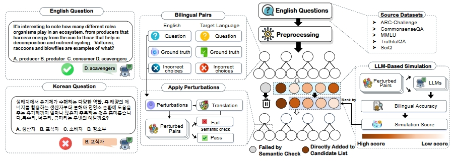

<h1 align="center">Cross-Lingual Pitfalls: Automatic Probing Cross-Lingual Weakness of Multilingual Large Language Models</h1>

## Updates & News
- [05/15/2025] 🥂 **Cross-Lingual Pitfalls has been accepted by ACL 2025! See you in Vienna!**

## Introduction

We introduce a systematic framework for studying **Cross-Lingual Weakness**—a critical challenge where LLMs fail to generalize their English proficiency to other languages. Our methodology enables:  

1. **Automated Weakness Identification**  
   Beam search-based perturbation strategy leveraging high-quality English datasets to systematically uncover cross-lingual weaknesses.  

2. **Quantitative Cross-Lingual Assessment**  
   A benchmarking framework measuring performance disparities across 16 languages, analyzing linguistic similarity effects.  

3. **Mitigation Strategy Evaluation**  
   Comparative analysis of fine-tuning effectiveness across languages, revealing how linguistic proximity influences adaptation.  

<p align="center">
    
</p>

## Installation

```bash
conda create -n clp python=3.9
conda activate clp
pip install -r requirements.txt
```

## Configuration

Place the .env file in the utils folder. You can selectively add API keys for the models you intend to use.

```properties
HTTP_PROXY=your_http_proxy
HTTPS_PROXY=your_https_proxy

OPENAI_API_KEY=your_openai_api_key

DEEPINFRA_BASE_URL=https://api.deepinfra.com/v1/openai
DEEPINFRA_API_KEY=your_deepinfra_api_key

YI_BASE_URL=https://api.lingyiwanwu.com/v1/
YI_API_KEY=your_yi_api_key

ANTHROPIC_API_KEY=your_anthropic_api_key
```

## Usage

### Step 1: Generate cross-lingual weaknesses

```bash
python run.py 
  --input-file data/source/mmlu.json 
  --output-file data/mmlu_Chinese.json 
  --language Chinese 
  --max-good 3 
  --max-queue 12 
  --batch-size 4 
  --models gpt-4o llama-3.1-8B qwen-2.5-72B gpt-4o-mini gemma-2-27B   
```

### Step 2: Evaluate performance disparities
```bash
python eva.py 
  --lang Chinese 
  --input_file data/Chinese.json 
  --output_file data/Chinese_results.json
```

### Step 3: Analyze Results
```bash
python visualization.py 
  --languages Chinese Japanese Korean French Spanish Italian Ukrainian German Bengali Hindi Arabic Hebrew Amharic Yoruba Swahili Zulu 
  --input_folder data/ 
  --output_folder visualizations/
```

## Citation

```bibtex
@misc{xu2025crosslingualpitfallsautomaticprobing,
      title={Cross-Lingual Pitfalls: Automatic Probing Cross-Lingual Weakness of Multilingual Large Language Models}, 
      author={Zixiang Xu and Yanbo Wang and Yue Huang and Xiuying Chen and Jieyu Zhao and Meng Jiang and Xiangliang Zhang},
      year={2025},
      eprint={2505.18673},
      archivePrefix={arXiv},
      primaryClass={cs.CL},
      url={https://arxiv.org/abs/2505.18673}, 
}
```